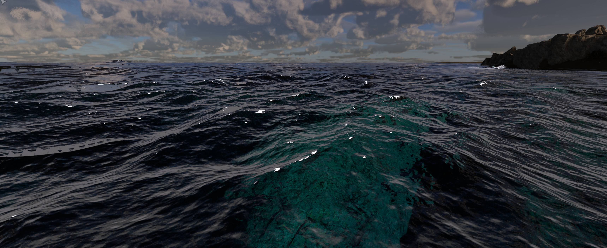
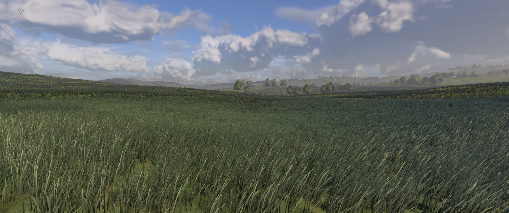
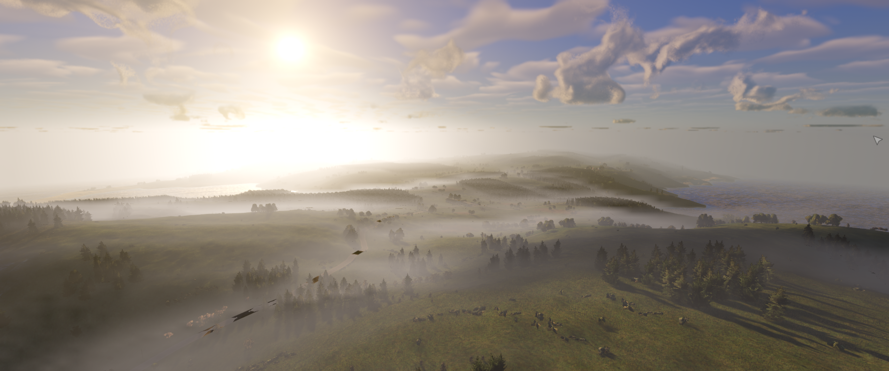
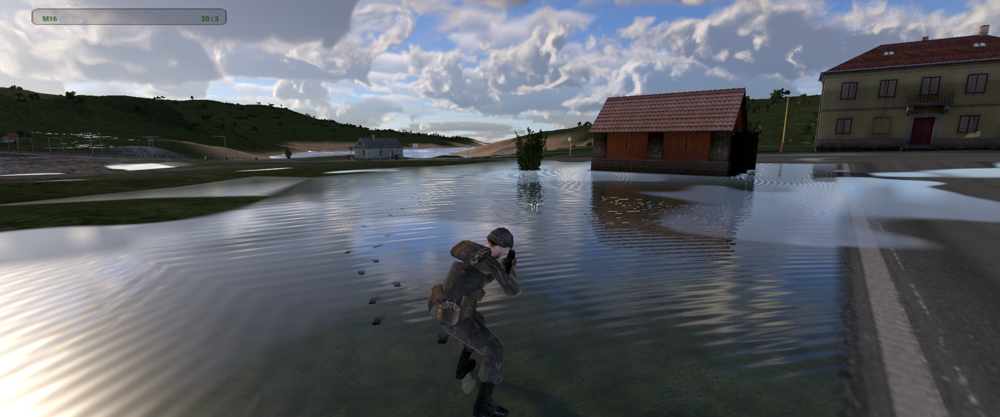
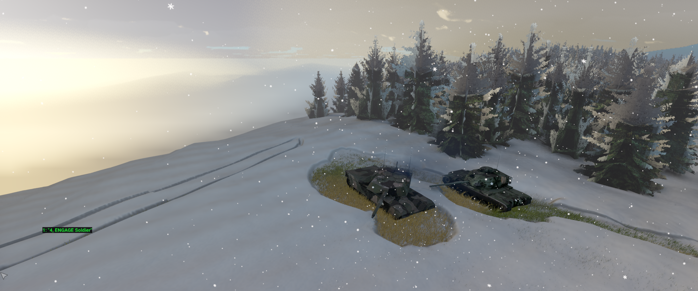
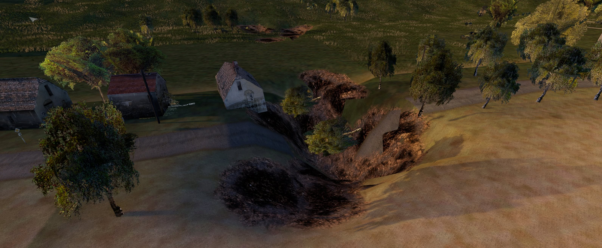
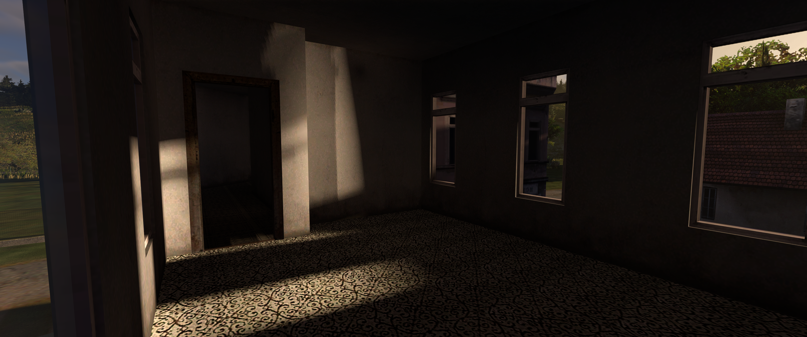
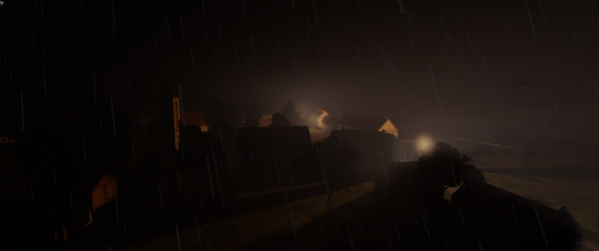
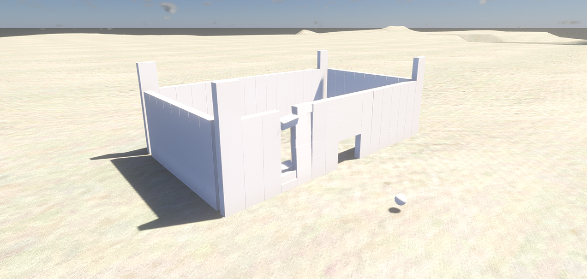
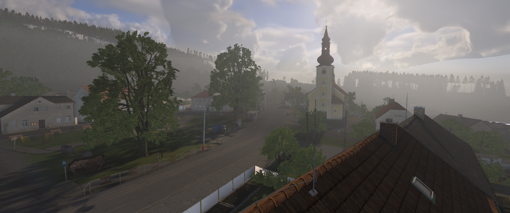

# Open Poseidon Engine

  

Open Poseidon Engine brings modern engine features to Operation Flashpoint / Arma:
Cold War Assault: WGPU/Vulkan rendering, optional DLSS upscaling, multithreading,
GTAO and probe-based global illumination (GI), volumetric fog, clouds and smoke,
and Box3D physics with articulated ragdolls. It is a community continuation of
the original engine, with expanded gameplay, terrain editing and content support.
It requires your own game data and is not a complete game or an official
Bohemia Interactive product.

## Precompiled builds

Prefer to play without compiling? Official precompiled Windows builds are available
in our [private downloads repository](https://github.com/OpenPoseidon/OpenPoseidon-Builds/releases).
For access, we ask for a small monthly contribution through
[GitHub Sponsors](https://github.com/sponsors/koosoli), helping fund continued
development, testing and build distribution. You can build the engine yourself
without a sponsorship; your rights under the software licences remain unchanged.

## Engine features

- **Vulkan rendering through WGPU:** Vulkan support on Windows and Linux,
  alongside Direct3D 12 on Windows. The active API depends on the platform,
  GPU and driver.
- **Physical inventory (single player):** open with **O** for vicinity cargo,
  drag/drop, equipped slots and weight/volume budgets; **K** opens inventory
  settings, including optional bearing callouts, a bearing readout and
  grenade-launcher ground-range estimates. Includes 17 original realistic
  equipment icons; addon pictures and
  labelled tiles remain fallbacks.
  Multiplayer keeps classic Gear; Dev Tools and Zeus are disabled in multiplayer.
- **Box3D physics and articulated ragdolls:** jointed character bodies, death and
  explosion reactions, and bullet reactivation of supported runtime corpses.
  Automatic ragdolls default to on, with a Physics developer-tab toggle.
- **Layered volumetric fog:** adjustable lower/upper heights, density, patchiness,
  valley/mountain presets, live controls, reset and a legacy-fog option. Local
  light scattering supports night lights and the player's torch.
- **GTAO:** screen-space ambient occlusion and bent-normal ambient shading,
  with live developer controls and diagnostic views.
- **Global illumination (GI):** a local irradiance probe grid combines indirect
  sky lighting with coloured sunlight bounced from nearby surfaces.
- **Lighting and shadows:** dynamic sun/local-light shadows, contact shadows,
  muzzle illumination and atmospheric light scattering.
- **Volumetric smoke:** buoyancy, wind response, room/portal-aware wall, floor
  and ceiling containment, doorway flow, self-shadowing and scene shadows.
  Containment depends on the building geometry/topology available to the engine.
- **Volumetric clouds and procedural sky:** overcast controls shared with Zeus,
  stars and cloud shadows affecting terrain, objects, grass and water.
- **Tidewater ocean:** FFT waves, shoreline wetness, reflections, foam, wakes,
  spray, underwater rendering and caustics; projectile/explosion and helicopter
  interactions, with supported boats following the drawn water surface.
- **Procedural grass:** travelling gust fronts, spatial wind variation,
  configurable coverage and player/vehicle/explosion/downwash interactions.
- **Weather and soft ground:** rain accumulation/drainage, puddle ripples,
  wet-ground/clothing shading, surface snow and terrain contact depressions.
  Stock Jeep and Truck5t wet-mud ruts/rolling resistance are enabled; boot-sole
  normal/parallax relief remains an opt-in prototype.
- **Snow depth and deformation:** compressed foot/vehicle tracks and projectile
  marks in depth-bearing ground snow, alongside roof and vegetation snow cover.
- **Destructible terrain and editor:** explosion craters, brush deformation,
  small cuts, horizontal caves/tunnels, straight and tank
  trenches, and excavation selection/rotation/deletion. This extends terrain
  holes; it is not a general voxel-world simulation.
- **Combat effects:** revised muzzle flashes with local illumination, snow
  projectile marks and helicopter ground downwash particles.
- **Firing from vehicles (FFV):** personal-rifle fire from configured passenger
  seats, aiming arcs, reload and action-menu Ready/Stow controls. Stock Jeep
  coverage is validated; other seats, weapon families and multiplayer are limited.
- **Satellite terrain textures (satmaps):** authored satellite layers and an
  automatic classic-world far-colour bake incorporating static roofs/vegetation.
  This is a ground colour representation, not a replacement for live object LODs.
- **Local content browser and editor:** terrain discovery for installed Arma
  1/2/3, DayZ and Reforger content, partial format conversion and selected vehicle
  bridges. Imported terrain opens in the native OFP mission editor with OFP units.
- **Streaming and developer tools:** geometry/residency work, GPU timings,
  debug views, test harnesses and Zeus freefly/unit placement.
- **Multithreading:** enkiTS worker jobs for selected terrain/cache, texture
  conversion and audio work, plus asynchronous streaming. This does not imply
  that every simulation/rendering operation runs on its own thread.
- **Upscaling:** AMD FSR 1 and an optional local NVIDIA DLSS integration.
  The proprietary NGX SDK/runtime is not bundled; distributable builds disable
  DLSS. Its availability depends on build configuration and compatible hardware.
- **Improved AI:** gunfire hearing/reporting, immediate orders and near-miss
  suppression, plus optional gradual spotting and cover/flank/search behavior.
  Behavior switches are configuration-dependent; this is not a universal new
  navigation system or complete replacement AI.
- **Swimming:** swimmer movement and boat-route/boarding support.

## Development screenshots

These captures illustrate development builds using locally installed game
content. Imported maps/assets are not included with the engine source.

| Tidewater ocean | Wind-driven procedural grass |
| --- | --- |
|  |  |
| **Layered volumetric fog** | **Rainwater and reflective puddles** |
|  |  |
| **Snow depth and vehicle tracks** | **Destructible terrain and craters** |
|  |  |
| **GTAO and interior shading** | **Night lighting and shadows** |
|  |  |
| **Box3D physics test scene** | **Local Reforger terrain compatibility** |
|  |  |

## Current limitations

Features are at different stages of acceptance. Dense/aerial fog can still show
patterns, and strong visible torch shafts remain unaccepted. Ragdoll tests cover
37 locally present stock models; two Camel pilot models retain post-hit settling
issues. Posture, saved-corpse reactivation, network ownership and physics budgets
also limit ragdoll admission. Arbitrary addon rigs are not universally supported.
Weather materials and modern-game material/LOD conversion still need refinement.
Soft-ground prototypes do not provide general soft-body vehicle physics.

## Content and building

To play Cold War Assault, use your own legally acquired installation. Game
archives, maps, models, textures, sounds and animation addons are not supplied
by this source release. Included project artwork and omitted binary test fixtures
are documented in [ASSETS.md](ASSETS.md). Original-game and modern-game compatibility remains
subject to the limitations in [COMPATIBILITY.md](COMPATIBILITY.md).

See [BUILDING.md](BUILDING.md) for the Windows build procedure and
[CONTRIBUTING.md](CONTRIBUTING.md) for contributions. The current Windows WGPU
path is the primary development target. Other platform presets exist but are
not a promise of equivalent runtime support.

The source is governed by [LICENSE](LICENSE), including its additional terms.
Third-party components retain their own licenses and notices. See
[CREDITS.md](CREDITS.md), [THIRD_PARTY_NOTICES.md](THIRD_PARTY_NOTICES.md) and
the notices shipped with individual components. Source availability does not
grant rights to proprietary game content or trademarks.
